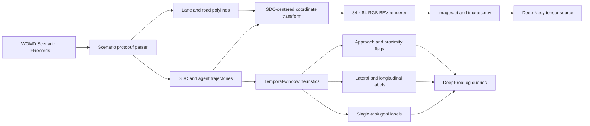
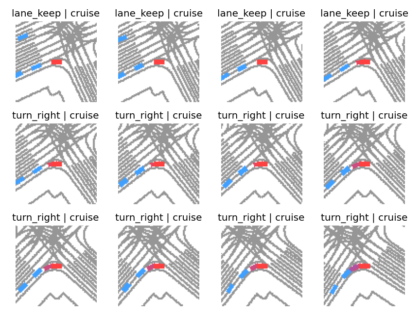

# Waymo Motion BEV Preprocessing Assets for Deep-Nesy

This directory documents the data pipeline used to transform Waymo Open Motion
Dataset (WOMD) Scenario TFRecords into bird's-eye-view (BEV) tensors and
high-level supervision signals for the Deep-Nesy driving-planning experiments.
The release is intended to make the data preparation described in the
associated manuscript inspectable and reproducible.

> **Waymo attribution.** This software and the accompanying research assets
> were made using the Waymo Open Dataset, provided by Waymo LLC under the
> [Waymo Dataset License Agreement for Non-Commercial Use](https://waymo.com/open/terms/).
> Access and use of these assets are governed by that agreement.

## What this release supports

The pipeline converts serialized WOMD scenarios into an SDC-centered visual
representation and aligned symbolic targets. The released evidence supports
the following bounded statement:

> For the three TFRecord shards in `train_sample/`, the preprocessing pipeline
> parsed 197 scenarios and generated 38,895 aligned 84 x 84 RGB BEV tensors,
> with no parsing errors or invalid-frame exclusions under the reported
> configuration.

This statement concerns data preparation only. It does not establish model
accuracy, robustness, or real-world driving performance.

## Pipeline overview



The renderer uses red for the self-driving car (SDC), blue for neighboring
agents, gray for map polylines, and a red-to-blue trail for recent SDC motion.



*Representative consecutive samples. Titles show the lateral and longitudinal
labels assigned by the temporal heuristics.*

## Empirical data summary

The statistics below were read from
`processed_data/preprocess_debug_summary.json` and
`processed_data/stats_visualization.json`.

| Input shard | Scenarios/frames processed | Frames retained | Errors |
|---|---:|---:|---:|
| `...tfrecord-00000-of-01000` | 12,053 frames | 12,053 | 0 |
| `...tfrecord-00001-of-01000` | 14,221 frames | 14,221 | 0 |
| `...tfrecord-00002-of-01000` | 12,621 frames | 12,621 | 0 |
| **Total** | **197 scenarios / 38,895 frames** | **38,895** | **0** |

### Single-task labels

| Label | Count | Fraction |
|---|---:|---:|
| `lane_keep` | 23,025 | 0.5920 |
| `turn_left` | 1,133 | 0.0291 |
| `turn_right` | 554 | 0.0142 |
| `stop` | 14,183 | 0.3646 |
| `overtake` | 0 | 0.0000 |

### Longitudinal labels

| Label | Count | Fraction |
|---|---:|---:|
| `accelerate` | 5,822 | 0.1497 |
| `decelerate` | 5,047 | 0.1298 |
| `cruise` | 13,843 | 0.3559 |
| `stop` | 14,183 | 0.3646 |

The lateral distribution matches the single-task distribution for these
shards: no lane-change or overtake events were detected by the configured
heuristics.

## Repository layout

```text
planner1/waymo/
  check_labels.py                 # Label integrity checks
  data.py                         # PyTorch and DeepProbLog data adapters
  preprocess_waymo.py             # Perception Frame preprocessing
  preprocess_waymo_motion.py      # WOMD Scenario-to-BEV pipeline
  visualize_motion_data.py        # Statistics and sample rendering

waymo_data/
  README.md
  train_sample/                   # Three source TFRecord shards (restricted)
  processed_data/
    images.pt                     # uint8 tensor: [38895, 3, 84, 84]
    images.npy                    # Memory-mappable copy of images.pt
    goals.pt                      # Single-task labels
    goals_lateral.pt              # Lateral labels
    goals_longitudinal.pt         # Longitudinal labels
    approaching_*_rear.pt         # Rear-approach Boolean signals
    close_*.pt                    # Forward-proximity Boolean signals
    preprocess_debug_summary.json
    stats_visualization.json
    samples/                      # De minimis illustrative PNG extracts
```

## Environment

The scripts were validated with Python 3.9 in the Conda environment
`deepproblog`. Core runtime dependencies are:

```text
numpy
Pillow
protobuf==3.20.3
torch
matplotlib
```

The official preprocessing path additionally uses a compatible TensorFlow and
`waymo-open-dataset` build. On systems where those packages are unavailable,
`preprocess_waymo_motion.py` can read uncompressed TFRecords directly and load
generated `map_pb2.py` and `scenario_pb2.py` modules from `WAYMO_PROTO_DIR`.

## Reproduce the processed tensors

First obtain WOMD Motion Scenario records directly from
[Waymo Open Dataset](https://waymo.com/open/) after accepting its license, and
place the selected shards under `waymo_data/train_sample/`.

### Official Waymo package

```bash
conda activate deepproblog
python planner1/waymo/preprocess_waymo_motion.py \
  --records waymo_data/train_sample \
  --out waymo_data/processed_data \
  --draw-map \
  --detect-overtake \
  --colorize \
  --dual-label \
  --label-window 10 \
  --stride 1 \
  --turn-threshold-deg 12 \
  --stop-speed 0.5 \
  --map-max-range 60 \
  --background-color 255,255,255 \
  --map-color 150,150,150 \
  --debug
```

### TensorFlow-free fallback

Set `WAYMO_PROTO_DIR` to a directory containing generated `map_pb2.py` and
`scenario_pb2.py`, then run the same command:

```bash
export WAYMO_PROTO_DIR=/absolute/path/to/waymo/protos
python planner1/waymo/preprocess_waymo_motion.py \
  --records waymo_data/train_sample \
  --out waymo_data/processed_data \
  --draw-map --detect-overtake --colorize --dual-label --debug
```

On PowerShell:

```powershell
$env:WAYMO_PROTO_DIR = "C:\absolute\path\to\waymo\protos"
python planner1\waymo\preprocess_waymo_motion.py `
  --records waymo_data\train_sample `
  --out waymo_data\processed_data `
  --draw-map --detect-overtake --colorize --dual-label --debug
```

## Reproduce the visual audit

```bash
python planner1/waymo/visualize_motion_data.py \
  --data-dir waymo_data/processed_data \
  --num-samples 12 \
  --grid-cols 4 \
  --save-individual \
  --no-show \
  --backend Agg
```

This command writes the label summary to `stats_visualization.json` and saves a
sample grid plus individual PNGs under `processed_data/samples/`.

## Interface with Deep-Nesy

`planner1/waymo/data.py` exposes two integration layers:

1. `load_waymo_tensors` and `get_tensor_sources` provide PyTorch datasets,
   preferring memory-mapped `images.npy` to reduce peak memory use.
2. `driving_planning_dataset` maps numeric targets to DeepProbLog queries for
   single, lateral, longitudinal, or dual prediction tasks.

An 80/20 index split is applied without reordering images. Query indices remain
aligned with the corresponding tensor split.

## Parameters used for the reported assets

| Parameter | Value |
|---|---:|
| Temporal stride | 1 frame |
| Label window | 10 frames |
| Turn threshold | 12 degrees |
| Stop-speed threshold | 0.5 m/s |
| Lane-change lateral threshold | 1.5 m |
| Acceleration threshold | 0.8 m/s2 |
| Deceleration threshold | 0.8 m/s2 |
| Map range | 60 m |
| BEV resolution | 84 x 84 |
| Spatial scale | 0.5 m/pixel |

The complete threshold record is stored in
`processed_data/preprocess_debug_summary.json`.

## Limitations and interpretation

- Labels are heuristic supervision signals derived from SDC motion; they are
  not official WOMD behavior annotations.
- This three-shard sample contains no detected lane-change or overtake events.
  It should not be used alone to evaluate rare-class performance.
- Consecutive frames are strongly correlated. The current 80/20 index split is
  suitable for pipeline checks but may leak scenario-level similarity across
  splits. Manuscript experiments should use scenario-disjoint partitions.
- BEV images simplify the scene and omit several semantic map attributes,
  traffic-light semantics, uncertainty, and raw sensor appearance.
- These assets are for non-commercial research and are not evidence of
  real-world vehicle safety or performance.

## Data access and redistribution

The full TFRecords and the full derived tensor dataset are not suitable for
unrestricted public GitHub distribution. The Waymo license permits public
de-minimis extracts for research illustration, while broader distribution of
the Dataset or modifications is limited to recipients who registered at
Waymo Open Dataset and accepted its terms.

Accordingly, a public source-code release should contain:

- the preprocessing and visualization scripts;
- this README and the JSON statistics;
- a small number of illustrative PNG samples; and
- instructions for licensed users to regenerate the full tensors locally.


## Citation

```bibtex
@misc{waymo_open_dataset,
  title   = {Waymo Open Dataset: An autonomous driving dataset},
  website = {\url{https://www.waymo.com/open}},
  year    = {2019--2025}
}
```

When citing the associated Deep-Nesy manuscript, add its final bibliographic
entry here after acceptance or public preprint release.

